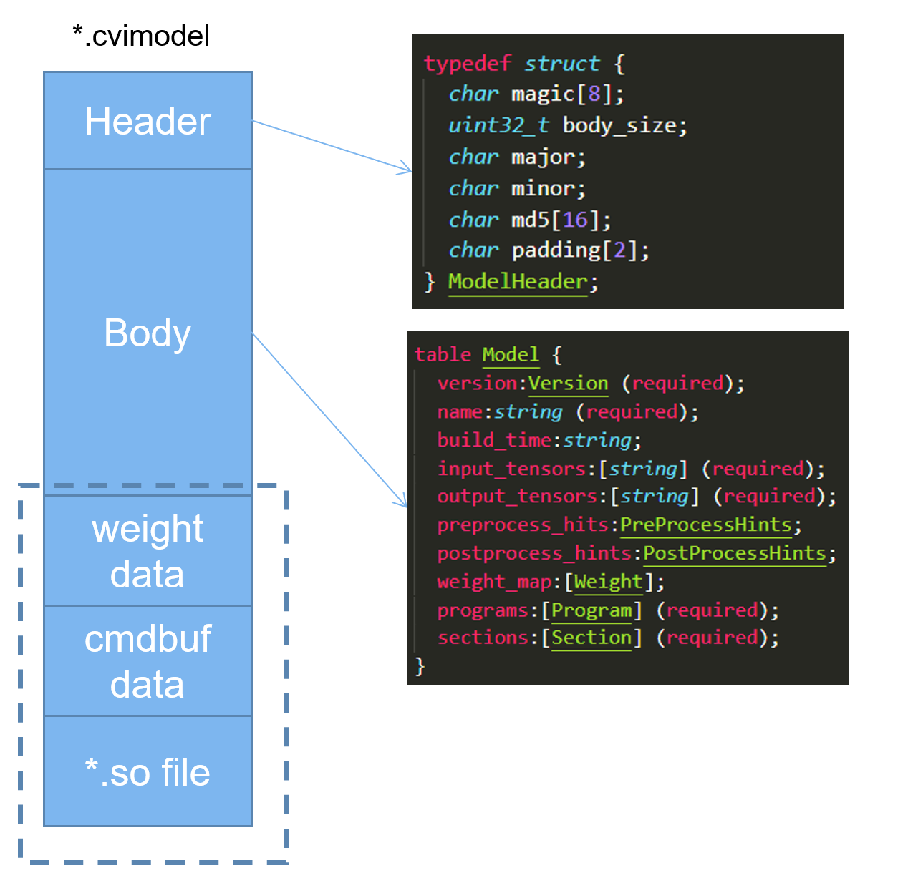

# CVITEK TPU SDK开发指南

>
>文档版本: 1.5.10
>
>发布日期: 2023-04-17
>
>适用于CV183x/CV182x/CV181x/CV180x系列芯片


本文件所含信息归<u>© 算能2022</u>所有。

未经授权，严禁全部或部分复制或披露该等信息。

<div STYLE="page-break-after: always;"></div>

# 法律声明

版权所有 © 算能 2022. 保留一切权利。
非经本公司书面许可, 任何单位和个人不得擅自摘抄、复制本文档内容的部分或全部, 并不得以任何形式传播。

**注意**
您购买的产品、服务或特性等应受算能商业合同和条款的约束, 本文档中描述的全部或部分产品、服务或特性可能不在您的购买或使用范围之内。除非合同另有约定, 算能对本文档内容不做任何明示或默示的声明或保证。由于产品版本升级或其他原因, 本文档内容会不定期进行更新。除非另有约定, 本文档仅作为使用指导, 本文档中的所有陈述、信息和建议不构成任何明示或暗示的担保。

<div STYLE="page-break-after: always;"></div>

# 目 录

[TOC]

<div STYLE="page-break-after: always;"></div>

# 第1章 概述

## 1.1 TPU介绍

> CVITEK TPU是晶视智能开发的边缘计算SoC平台(CV183x/CV182x/CV181x/CV180x)的异构计算引擎。实现了对主流神经网络运算的高效硬件加速，兼顾执行效率和可编程灵活性。计算精度方面同时支持高效的INT8和高动态范围的BF16两种模式，并通过软件平台支持灵活的混合精度配置。


## 1.2 工具链介绍

> CVITEK TPU工具链是一个高效，开放，透明，可扩展，模型移植全流程可控的神经网络编译优化开发工具集。


## 1.3 软件框架

TPU软件开发框图如下图所示:


> 软件框架由Offline工具链和Runtime模型推理库两部分组成。Offline工具链包括模型转换，编译器，量化工具等组件，完成从用户模型导入，变换，量化，优化，到代码生成等步骤，最终组装为cvimodel格式的推理模型文件。Runtime模型推理库加载cvimodel，读取运行时信息进行设置和资源分配，加载权重数据和指令序列，驱动硬件执行其中的指令序列，完成神经网络推理计算任务，输出推理结果数据。Runtime包含完整仿真平台的支持，客户可以先在仿真平台完成模型移植，验证和精度测试，再加载到真实硬件上验证和执行。


## 1.4 神经网络编译器

> 神经网络编译器基于MLIR框架开发。编译器完成从一个现有框架模型文件到TPU指令集的转换。具体参考《TPU-MLIR快速入门指南》:

## 1.5 算子支持列表
### 1.5.1 基础Operation的支持列表：
>
> | 算子                              | Engine    | INT8 |
> | --------------------------------- | --------- | ---- |
> | Abs                               | TPU       | Y    |
> | Add                               | TPU       | Y    |
> | Arg                               | TPU + CPU | Y    |
> | AvgPool                           | TPU       | Y    |
> | Cast                              | TPU       | Y    |
> | Clip                              | TPU       | N    |
> | Concat                            | TPU       | Y    |
> | Conv                              | TPU       | Y    |
> | Copy                              | TPU       | Y    |
> | Deconv                            | TPU       | Y    |
> | Depth2Space                       | TPU       | Y    |
> | DetectionOutput                   | CPU       | N    |
> | Elu                               | TPU       | Y    |
> | Exp                               | TPU       | Y    |
> | FrcnDetection                     | CPU       | N    |
> | Gather                            | CPU       | N    |
> | GatherND                          | CPU       | N    |
> | GELU                              | TPU       | Y    |
> | GridSampler                       | CPU       | N    |
> | GRU                               | TPU       | N    |
> | HardSigmoid                       | TPU       | Y    |
> | HardSwish                         | TPU       | Y    |
> | InstanceNorm                      | CPU       | N    |
> | Interp                            | TPU / CPU | Y    |
> | LayerNorm                         | TPU       | N    |
> | LeakyRelu                         | TPU       | Y    |
> | Log                               | TPU       | Y    |
> | LRN                               | TPU       | N    |
> | LSTM                              | TPU       | N    |
> | MatchTemplate ( TM_CCOEFF_NORMED) | TPU       | N    |
> | MatMul                            | TPU       | Y    |
> | Max                               | TPU       | Y    |
> | MaxPool                           | TPU       | Y    |
> | Min                               | TPU       | Y    |
> | Mish                              | TPU       | Y    |
> | Mul                               | TPU       | Y    |
> | MulConst                          | TPU       | Y    |
> | Pad                               | TPU       | Y    |
> | Permute                           | TPU       | Y    |
> | PoolMask                          | TPU       | Y    |
> | Pow                               | TPU       | Y    |
> | PRelu                             | TPU       | Y    |
> | Proposal                          | CPU       | N    |
> | Reciprocal                        | TPU       | Y    |
> | Reduce                            | TPU       | Y    |
> | Relu                              | TPU       | Y    |
> | Reshape                           | None      | Y    |
> | RetinaFaceDetection               | CPU       | N    |
> | Reverse                           | TPU       | Y    |
> | ROIPooling                        | CPU       | N    |
> | Scale                             | TPU       | Y    |
> | ScaleLut                          | TPU       | Y    |
> | ScatterND                         | TPU       | Y    |
> | ShuffleChannel                    | TPU       | Y    |
> | Sigmoid                           | TPU       | Y    |
> | SiLU                              | TPU       | Y    |
> | Slice                             | TPU       | Y    |
> | Softmax                           | TPU       | Y    |
> | Softplus                          | TPU       | Y    |
> | Softsign                          | TPU       | Y    |
> | Sub                               | TPU       | Y    |
> | SubConst                          | TPU       | Y    |
> | SwapChannle                       | TPU       | Y    |
> | Tanh                              | TPU       | Y    |
> | Tile                              | TPU       | Y    |
> | Upsample                          | TPU       | Y    |
> | YoloDetection                     | CPU       | N    |
>

> (1) Engine：来指定当前指令的执行阶段，TPU表示指令在TPU上执行，CPU表示在CPU上执行,  TPU+CPU表示该OP的部分指令在TPU上执行部分执行在CPU上，TPU / CPU根据不同模式指令执行在TPU上或CPU上, None表示不产生实际的指令。

> (2) INT8：表示该OP是否支持INT8量化,  在CPU中执行的指令是不需要做量化的。

### 1.5.2 ONNX算子的支持列表：

| 算子                  | Engine    |
| --------------------- | --------- |
| Abs                   | TPU       |
| Add                   | TPU       |
| ArgMax                | TPU + CPU |
| AveragePool           | TPU       |
| BatchNormalization    | TPU       |
| Cast                  | TPU       |
| Concat                | TPU       |
| Constant              | TPU       |
| ConstantOfShape       | Numpy     |
| Conv                  | TPU       |
| Clip                  | TPU       |
| ConvTranspose         | TPU       |
| DepthToSpace          | TPU       |
| Div                   | TPU       |
| Dropout               | None      |
| Einsum                | TPU       |
| Elu                   | TPU       |
| Equal                 | TPU       |
| Exp                   | TPU       |
| Expand                | TPU       |
| Flatten               | TPU       |
| Gather                | CPU       |
| GatherND              | CPU       |
| GELU                  | TPU       |
| Gemm                  | TPU       |
| GlobalAveragePool     | TPU       |
| GlobalMaxPool         | TPU       |
| GridSample            | CPU       |
| GRU                   | TPU       |
| HardSigmoid           | TPU       |
| HardSwish             | TPU       |
| Identity              | None      |
| InstanceNormalization | CPU       |
| LayerNormalization    | TPU       |
| LeakyRelu             | TPU       |
| Log                   | TPU       |
| LogSoftmax            | TPU       |
| LRN                   | TPU       |
| LSTM                  | TPU       |
| MatMul                | TPU       |
| Max                   | TPU       |
| MaxPool               | TPU       |
| Min                   | TPU       |
| Mul                   | TPU       |
| Neg                   | TPU       |
| Pad                   | TPU       |
| PixelNormalization    | TPU       |
| PRelu                 | TPU       |
| Pow                   | TPU       |
| Reciprocal            | TPU       |
| ReduceMean            | TPU       |
| ReduceMax             | TPU       |
| ReduceMin             | TPU       |
| ReduceL2              | TPU       |
| ReduceSum             | TPU       |
| Relu                  | TPU       |
| Reshape               | None      |
| Resize                | TPU / CPU |
| ScatterND             | TPU       |
| Shape                 | Numpy     |
| Sigmoid               | TPU       |
| Slice                 | TPU       |
| Softmax               | TPU       |
| Softplus              | TPU       |
| Squeeze               | TPU       |
| Split                 | TPU       |
| Std                   | TPU       |
| Sub                   | TPU       |
| Sum                   | TPU       |
| Sqrt                  | TPU       |
| Tanh                  | TPU       |
| Tile                  | TPU       |
| Transpose             | TPU       |
| Unsqueeze             | TPU       |
| Upsample              | TPU / CPU |
| Where                 | TPU       |

### 1.5.2 Caffe算子的支持列表：
| 算子                 | Engine    |
| -------------------- | --------- |
| ArgMax               | TPU + CPU |
| BatchNorm            | TPU       |
| BN                   | TPU       |
| Concat               | TPU       |
| Convolution          | TPU       |
| ConvolutionDepthwise | TPU       |
| Crop                 | TPU       |
| Deconvolution        | TPU       |
| DetectionOutput      | CPU       |
| Dropout              | None      |
| DummyData            | None      |
| Embed                | CPU       |
| Eltwise              | TPU       |
| Flatten              | None      |
| FrcnDetection        | CPU       |
| InnerProduct         | TPU       |
| Input                | None      |
| Interp               | TPU       |
| ImageData            | None      |
| LRN                  | TPU       |
| LSTM                 | TPU       |
| Lstm                 | TPU       |
| MatMul               | TPU       |
| Mish                 | TPU       |
| Normalize            | TPU       |
| Padding              | TPU       |
| Permute              | TPU       |
| Pooling              | TPU       |
| Power                | TPU       |
| PReLU                | TPU       |
| PriorBox             | TPU       |
| Proposal             | CPU       |
| ReLU                 | TPU       |
| ReLU6                | TPU       |
| Reorg                | TPU       |
| Reshape              | None      |
| Reverse              | TPU       |
| RetinaFaceDetection  | CPU       |
| ROIPooling           | CPU       |
| Scale                | TPU       |
| ShuffleChannel       | TPU       |
| Sigmoid              | TPU       |
| Silence              | None      |
| Slice                | TPU       |
| Softmax              | TPU       |
| Split                | TPU       |
| TanH                 | TPU       |
| Tile                 | TPU       |
| Upsample             | TPU       |
| YoloDetection        | CPU       |

### 1.5.3 Torch算子的支持列表：

| 算子                  | Engine    |
| --------------------- | --------- |
| torch.abs             | TPU       |
| torch.add             | TPU       |
| torch.addmm           | TPU       |
| torch.arange          | TPU       |
| torch.bmm             | TPU       |
| torch.chunk           | TPU       |
| torch.concat          | TPU       |
| torch.div             | TPU       |
| torch.grid_sampler    | CPU       |
| torch.index_select    | TPU       |
| torch.matmul          | TPU       |
| torch.mean            | TPU       |
| torch.mm              | TPU       |
| torch.multiply        | TPU       |
| torch.ones            | TPU       |
| torch.ones_like       | TPU       |
| torch.permute         | TPU       |
| torch.pow             | TPU       |
| torch.reshape         | None      |
| torch.select          | TPU       |
| torch.slice           | TPU       |
| torch.split           | TPU       |
| torch.squeeze         | TPU       |
| torch.sqrt            | TPU       |
| torch.stack           | TPU       |
| torch.sub             | TPU       |
| torch.sum             | TPU       |
| torch.t               | TPU       |
| torch.tile            | TPU       |
| torch.transpose       | TPU       |
| torch.unsqueeze       | None      |
| torch.where           | TPU       |
| torch.zeros           | TPU       |
| torch.zeros_like      | TPU       |
| nn.BatchNorm1d        | TPU       |
| nn.BatchNorm2d        | TPU       |
| nn.ChannelShuffle     | TPU       |
| nn.ConstantPad1d      | TPU       |
| nn.ConstantPad2d      | TPU       |
| nn.Conv1d             | TPU       |
| nn.Conv2d             | TPU       |
| nn.ConvTranspose2d    | TPU       |
| nn.Dropout            | None      |
| nn.Embedding          | CPU       |
| nn.GELU               | TPU       |
| nn.GRU                | TPU       |
| nn.Hardsigmoid        | TPU       |
| nn.Hardswish          | TPU       |
| nn.InstanceNorm2d     | CPU       |
| nn.LayerNorm          | TPU       |
| nn.Linear             | TPU       |
| nn.LogSigmoid         | TPU       |
| nn.LSTM               | TPU       |
| nn.Mish               | TPU       |
| nn.MaxPool1d          | TPU       |
| nn.MaxPool2d          | TPU       |
| nn.MaxPool3d          | TPU       |
| nn.MultiheadAttention | TPU       |
| nn.PixelShuffle       | TPU       |
| nn.ReflectionPad1d    | TPU       |
| nn.ReflectionPad2d    | TPU       |
| nn.ReLU               | TPU       |
| nn.ReLU6              | TPU       |
| nn.ReplicationPad1d   | TPU       |
| nn.ReplicationPad2d   | TPU       |
| nn.Sigmoid            | TPU       |
| nn.SiLU               | TPU       |
| nn.Softplus           | TPU       |
| nn.Softsign           | TPU       |
| nn.Tanh               | TPU       |
| nn.Upsample           | TPU / CPU |
| F.adaptive_avg_pool2d | TPU       |
| F.avg_pool1d          | TPU       |
| F.avg_pool2d          | TPU       |
| F.avg_pool3d          | TPU       |
| F.elu                 | TPU       |
| F.interpolate         | TPU / CPU |
| F.leaky_relu          | TPU       |
| F.log_softmax         | TPU       |
| F.prelu               | TPU       |
| F.softmax             | TPU       |
| F.softmin             | TPU       |
| Tensor.new_zeros      | TPU       |
| Tensor.repeat         | TPU       |
| Tensor.to             | None      |
| Tensor.type_as        | None      |
| Tensor.view           | None      |

## 1.6 模型转储cvimodel文件

> cvimodel文件是离线编译的最终结果，交付给runtime进行解析和在线推理。cvimodel还支持：

-   多batch和多分辨率：对于不同的batch_size和输入分辨率，由于资源和优化选择等差异，需要执行不同的指令序列，但共享权重数据。cvimodel采用相应文件数据格式支持同一模型对多种batch和多种分辨率的推理。

-   模型分段：对于包含TPU不支持算子的模型，支持采用TPU和CPU协同方式进行推理计算。将一个模型分成若干段，每段由特定引擎（TPU或CPU）分别执行。

> 为cv183x平台生成的cvimodel可以运行在1832/1835/1838等cv183x系统芯片上; 为cv182x平台生成的cvimodel可以运行在1821/1822/1826等cv182x系列芯片上；为cv181x平台生成的cvimodel可以运行在1810C/1811C/1812C/1810H/1811H/1812H等cv181x系列芯片上；为cv180x平台生成的cvimodel可以运行在cv180x系列芯片上.

> cvimodel采用flatbuffers进行对权重数据、指令序列以及张量的相关信息进行打包封装，用于部署到平台上。

-   模型（Model）：

> 为网络模型所有信息的集合，单个cvimodel中只能包含一个Model对象，但可以包含多个Batch的指令序列。

-   程序（Program）：

> 对应不同batch的指令序列。指令序列包含TPU段和CPU段，分别表示在TPU上运行的指令以及需要切换到CPU上运行的代码段。

-   段（Routine）：

> 现分为TPU段和CPU段。单个Program中可能包含多个TPU段或者CPU段，在运行时会依序执行。

-   张量（Tensor）：

> 为输入输出张量和Activation等的统称，张量中包含其名称、Shape、基本数据类型等信息。

### 1.6.1 Cvimodel结构

> 
>
> Cvimodel的基本结构如上图所示，分为三段。首段为cvimodel文件的header部分，包含magic字串，版本号，中段的数据字节数、md5值等数据，是解析cvimodel文件的基本信息；中段为Model的结构信息，包含Program、Routines等信息，用于解析网络模型的结构和指令信息；尾段为二进制数据段，包含权重数据，各Program的TPU指令序列，以及存储用户自定义CPU段的so文件。

## 1.7 Runtime

> Runtime库和应用程序运行在CV183x/CV182x/CV181x/CV180x SoC的ARM/AARCH64/RISCV处理器Linux系统中。Runtime提供一组API供应用程序运行时调用，实现模型在板端的在线推理。主要功能包括：

-   解析cvimodel文件；

-   加载权重数据、根据配置的batch_size和分辨率信息加载指令序列数据；

-   根据CPU段信息加载CPU函数；

-   加载输入数据；

-   执行推理计算；

-   返回结果数据。


### 1.7.1 Python Binding

> Runtime支持Python Binding，方便利用python的数据预处理和后处理代码快速进行模型开发和验证以及离线仿真。


### 1.7.2 仿真器

> Runtime除了调用硬件外，还支持以同样的API调用仿真器，进行离线测试和调试。


## 1.8 开发环境配置

推荐使用docker，具体使用方法请参考《TPU快速入门指南》。

<div STYLE="page-break-after: always;"></div>

<div STYLE="page-break-after: always;"></div>

# 第2章 Runtime开发指南

## 2.1 查看cvimodel

在runtime环境中部署cvimodel，请现在命令行中使用cvimodel_tool去查看cvimodel的详情，如输入、输出tensors的shape、name等，权重、Activations占用空间等信息，具体使用方法如下：
```sh
$ cvimodel_tool -a dump -i xxx.cvimodel
```
该命令的输出如下：

a. 版本信息部分：
```sh
Cvitek Runtime 1.2.0 # runtime lib的版本号
Mlir Version: tpu_rel_v1.3.4-42-g2bd9f2a54-dirty:20201205
# 编译此cvimodel所用工具链的版本号
Cvimodel Version: 1.2.0 # cvimodel的版本号
Build at 2020-12-05 23:37:09 # cvimodel编译的时间
CviModel Need ION Memory Size: (5.74 MB) # 模型会使用的ION内存大小
```

b. 权重和指令段
```sh
 Sections:

 ID   TYPE   NAME        SIZE   OFFSET ENCRYPT MD5
 000 weight weight       820800 0      False   49974c...
 001 cmdbuf tpu_func0_3e 1440   820800 False   caa513...
```
其中size为部署时weight或者cmdbuf(指令)所占用的memory的大小；encrypt表示该段是否为加密保存；MD5为该段数据的hash值，用于检查数据的完整性

c. 权重tensor列表
```sh
WeightMap:
ID  OFFSET SIZE   TYPE  N   C    H W NAME
000 1600   819200 int8  400 2048 1 1 filter_quant_lowered
001 0      1600   int32 400 1    1 1 bias_quant_lowered
```
d. program信息

> program对应于执行推理所需要的结构信息，具体包括Activations占用空间，模型的输入、输出tensor的名称，tpu子程序或者cpu子程序的详情以及tensor列表等信息
```sh
 Program %0
  batch_num : 1
  private_gmem_size: 0  # 私有memory大小
  shared_gmem_size: 448 # 共有memory\\<多个模型共享的内存区域\\>大小
  inputs: data_quant    # 模型输入tensor名称，可对应于后面的tensor列表
  outputs: input.7_Split_dequant # 模型输出tensor名称，可对应于后面的tensor列表

  routines: # program可有多个tpu或cpu子程序组成
    %000 tpu # tpu子程序
      inputs : data_quant
      outputs : input.7_Split_dequant
      section : tpu_func0_3e

  tensor_map: # tensor列表
    ID  OFFSET TYPE N C H    W QSCALE   MEM    NAME
    000 0      int8 1 1 2048 1 5.314389 io_mem data_quant
    001 0      int8 1 1 400  1 -        shared fc
    002 10     int8 1 1 100  1 0.095460 shared input.7_Split
    003 0      fp32 1 1 100  1 -        io_mem input.7_Split_dequant
```


## 2.2 Runtime开发流程

### 模型加载

> Runtime对一个模型进行推理计算首先需要加载模型文件，runtime加载的对象为cvimodel文件。

### 获取输入输出Tensor

> 接下来，程序通过API分别获取Input Tensor和Output Tensor信息。对于支持多种batch_size的cvimodel，需要则会获取Tensor时指定batch_size。每个Tensor有自身的名称，类型，维度信息，以及存储空间。

### 执行推理

> 数据和buffer准备完毕后就可以开始推理计算。

### 预处理和后处理

> 预处理和后处理有几种处理方式。

-   应用程序自理：用户根据模型对前处理的需要，自行添加代码实现。

-   优化为预处理TPU段：在模型导入阶段，通过命令控制增加相应预处理或后处理操作。编译时，通过优化命令，对符合条件的预处理或后处理操作转换为TPU操作并编译进TPU Section中。运行时，随模型执行过程由TPU进行处理。

<br>

## 2.3 Runtime API参考

### 2.3.1 Runtime C API参考

头文件cviruntime.h中定义了runtime C API的数据结构和函数，用于模型的加载和推理，对应的动态库为libcviruntime.so，静态库为libcviruntime-static.a。

#### 数据结构

> TPU Runtime涉及下列主要数据结构。

-   CVI_FMT：张量数据的基本类型

-   CVI_MEM_TYPE_E：张量数据的存储内存类型

-   CVI_SHAPE：张量数据的维度

-   CVI_MEM：张量数据的存储内存信息

-   CVI_TENSOR：张量数据结构

-   CVI_FRAME_TYPE：数据帧类型

-   CVI_VIDEO_FRAME_INFO：视频帧数据结构

-   CVI_MODEL_HANDLE：网络模型句柄

-   CVI_CONFIG_OPTION：选项配置

##### CVI_FMT
```c++
typedef enum {
  CVI_FMT_FP32 = 0,
  CVI_FMT_INT32 = 1,
  CVI_FMT_UINT32 = 2,
  CVI_FMT_BF16 = 3,
  CVI_FMT_INT16 = 4,
  CVI_FMT_UINT16 = 5,
  CVI_FMT_INT8 = 6,
  CVI_FMT_UINT8 = 7
} CVI_FMT;
```
【描述】

TENSOR的基本数据类型

|  名称             |描述|
|---------------- |--------------|
|  CVI_FMT_FP32   |  float 32类型|
|  CVI_FMT_INT32  |  int32 类型|
|  CVI_FMT_UINT32 |  uint32类型|
|  CVI_FMT_BF16   |  bfloat16类型|
|  CVI_FMT_INT16  |  int16类型|
|  CVI_FMT_UINT16 |  uint16类型|
|  CVI_FMT_INT8   |  int8类型|
|  CVI_FMT_UINT8  |  uint8类型|

##### CVI_MEM_TYPE_E
```c++
typedef enum {
  CVI_MEM_UNSPECIFIED = 0,
  CVI_MEM_SYSTEM      = 1,
  CVI_MEM_DEVICE      = 2
} CVI_MEM_TYPE_E;
```
【描述】

定义数据存储类型，表示数据存储的位置

|  名称                  |描述|
|--------------------- |-------------------------------|
|  CVI_MEM_UNSPECIFIED |  初始值，表示未指定MEM内存来源|
|  CVI_MEM_SYSTEM      |  MEM来自于系统内存|
|  CVI_MEM_DEVICE      |  MEM来自于设备内存|

##### CVI_SHAPE
```c++
#define CVI_DIM_MAX (6)

typedef struct {
  int32_t dim[CVI_DIM_MAX];
  size_t dim_size;
} CVI_SHAPE;
```
【描述】

定义TENSOR数据维度，按照n/channel/height/width四个维度排列.

  名称       描述
|名称|描述|
|---|---|
|dim       | 各个维度大小|
|dim_size  | 维度数量，最多为6个维度|

##### CVI_TENSOR
```c++
typedef struct {
  char            *name;
  CVI_SHAPE       shape;
  CVI_FMT         fmt;
  size_t          count;
  size_t          mem_size;
  uint8_t         *sys_mem;
  uint64_t        paddr;
  CVI_MEM_TYPE_E  mem_type;
  float           qscale;
  ...
} CVI_TENSOR;
```

【描述】

定义TENSOR结构体

|  名称       |描述|
|---------- |------------------------|
|  name     |  tensor的名称|
|  shape    |  tensor代表的维度|
|  fmt      |  tensor的基本数据类型|
|  count    |  tensor代表的元素个数|
|  mem_size |  tensor的所占用内存的大小|
|  sys_mem  |  内存指针，指向系统内存|
|  paddr    |  内存指针的物理地址    |
|  mem_type |  tensor输入内存的类型 |
|  qscale   |  量化转换比例系数|
<br/>

##### CVI_FRAM_TYPE
```c++
typedef enum {
  CVI_NN_PIXEL_RGB_PACKED    = 0,
  CVI_NN_PIXEL_BGR_PACKED    = 1,
  CVI_NN_PIXEL_RGB_PLANAR     = 2,
  CVI_NN_PIXEL_BGR_PLANAR     = 3,
  CVI_NN_PIXEL_YUV_420_PLANAR = 13,
  CVI_NN_PIXEL_GRAYSCALE      = 15,
  CVI_NN_PIXEL_TENSOR         = 100,
  // please don't use below values,
  // only for backward compatibility
  CVI_NN_PIXEL_PLANAR         = 101,
  CVI_NN_PIXEL_PACKED        = 102
} CVI_NN_PIXEL_FORMAT_E;

typedef CVI_NN_PIXEL_FRAME_E CVI_FRAME_TYPE;
```

【描述】

定义输入数据的格式

|  名称                |描述|
|------------------- |----------------------|
| CVI_NN_PIXEL_RGB_PACKED     | RGB packed类型,格式为nhwc|
| CVI_NN_PIXEL_BGR_PACKED     | BGR packed类型,格式为nhwc|
| CVI_NN_PIXEL_RGB_PLANAR     | RGB planar类型,格式为nchw|
| CVI_NN_PIXEL_BGR_PLANAR     | BGR planar类型,格式为nchw|
| CVI_NN_PIXEL_YUV_420_PLANAR | YUV420 planar类型|
| CVI_NN_PIXEL_GRAYSCALE      | 灰度图, YUV400|
| CVI_NN_PIXEL_TENSOR         | 紧密排布的4维度张量(1.3版本前默认类型|

##### CVI_VIDEO_FRAME_INFO
```c++
typedef struct {
  CVI_FRAME_TYPE type;
  CVI_SHAPE shape;
  CVI_FMT fmt;
  uint32_t stride[3];
  uint64_t pyaddr[3];
} CVI_VIDEO_FRAME_INFO;
```
【描述】

定义数据帧类型

|  名称     |描述|
|---|---|
|  type     |数据帧类型|
|  shape    |数据帧的维度数据|
|  fmt      |基本数据类型|
|  stride   |frame w维度的间隔，对齐到字节|
|  pyaddr   |通道的物理地址，当type为PLANAR时需要填入每个通道的地址；当type为PACKED时，只用填数据首地址|

##### CVI_MODEL_HANDLE
```c++
typedef void *CVI_MODEL_HANDLE;
```
【描述】

神经网络模型句柄，通过接口CVI_NN_RegisterModel得到该句柄，并由接口

CVI_NN_CleanupModel释放句柄的资源。

##### CVI_CONFIG_OPTION
```c++
typedef enum {
  OPTION_OUTPUT_ALL_TENSORS = 4,
  OPTION_PROGRAM_INDEX      = 9
} CVI_CONFIG_OPTION;
```
【描述】

定义CVI_NN_SetConfig接口获取或者设置模型配置的枚举类型:

|名称                       | 类型   |默认值  | 描述|
|---|---|---|---|
|OPTION_PRGRAM_INDEX        |   int  |  0     |   配置推理模型的program index，cvimodel可以存放模型多个batch size或者多种分辨率的指令(或称为program)，通过program id可以选择执行对应的program|
|OPTION_OUTPUT_ALL_TENOSRS|   bool |  false |   配置runtime将模型所有可见的TENSOR作为模型的输出，则选项可以作为debug的手段之一|

##### 返回码
```c++
 #define CVI_RC_SUCCESS 0 // The operation was successful
 #define CVI_RC_AGAIN 1   // Not ready yet
 #define CVI_RC_FAILURE 2 // General failure
 #define CVI_RC_TIMEOUT 3 // Timeout
 #define CVI_RC_UNINIT 4  // Uninitialzed
 #define CVI_RC_INVALID_ARG 5 // Arguments invalid
 #define CVI_RC_NOMEM 6       // Not enough memory
 #define CVI_RC_DATA_ERR 7    // Data error
 #define CVI_RC_BUSY 8        // Busy
 #define CVI_RC_UNSUPPORT 9   // Not supported yet
 typedef int CVI_RC;
```
【描述】

返回码用于表示接口执行结果是否存在异常，其中CVI_RC_SUCCESS为成功，其他值为失败。

#### 函数

> TPU Runtime提供下述基本接口。

-   CVI_NN_RegisterModel：从文件中加载神经网络模型
-   CVI_NN_RegisterModelFromBuffer：从内存中加载网络模型
-   CVI_NN_RegisterModelFromFd：从fd加载网络模型
-   CVI_NN_CloneModel: 复制神经网络模型
-   CVI_NN_SetConfig:　配置神经网络模型
-   CVI_NN_GetInputOutputTensors：获取输入以及输出TENSOR的信息
-   CVI_NN_Forward：神经网络推理，同步接口
-   CVI_NN_ForwardAsync：神经网络推理，异步接口
-   CVI_NN_ForwardWait：等待推理任务完成
-   CVI_NN_CleanupModel：释放网络资源
-   CVI_NN_GetTensorByName：根据名字获取张量信息
-   CVI_NN_TensorPtr：获取张量的系统内存指针
-   CVI_NN_TensorSize：获取张量的系统内存大小
-   CVI_NN_TensorCount：获得张量的元素个数
-   CVI_NN_TensorQuantScale：获得张量的量化系数
-   CVI_NN_TensorShape：获得张量的Shape
-   CVI_NN_SetTensorPtr：设置张量的系统内存
-   CVI_NN_SetTensoPhysicalAddrr：设置张量的物理内存
-   CVI_NN_SetTensorWithAlignedFrames：将视频帧数据拷贝到张量
-   CVI_NN_SetTensorWithVideoFrames: 将视频帧数据拷贝到张量

##### CVI_NN_RegisterModel

【原型】
```c++
 CVI_RC CVI_NN_RegisterModel(
     const char *model_file,
     CVI_MODEL_HANDLE *model)
```
【描述】

> 从文件中加载cvimodel，并返回模型句柄。此句柄将作为后续API调用的接口的参数。当模型不再使用时，需要调用CVI_NN_CleanupModel接口对模型资源进行释放。

|参数名称|描述|输入/输出|
|---|---|---|
|Model_file |cvimodel模型文件名  |输入|
|model      |网络模型句柄        |输出|

<br>

##### CVI_NN_RegisterModelFromBuffer

【原型】
```c++
CVI_RC CVI_NN_RegisterModelFromBuffer(
    const int8_t *buf,
    uint32_t size,
    CVI_MODEL_HANDLE *model);
```
【描述】

> 从内存中加载cvimodel，并返回模型句柄。此句柄将作为后续API调用的接口的参数。当模型不再使用时，需要调用CVI_NN_CleanupModel接口对模型资源进行释放。

|  参数名称   |描述             |输入/输出|
|---------- |-------------|---|
|  buf      |  内存地址       |  输入|
|  size     |  模型的内存大小  | 输入|
|  model    |  网络模型句柄    | 输出|

<br>

##### CVI_NN_RegisterModelFromFd

【原型】

```c++
CVI_RC CVI_NN_RegisterModelFromFd(
    const int32_t fd,
    const size_t ud_offset,
    CVI_MODEL_HANDLE *model);
```

【描述】

> 从fd的offset位置加载cvimodel，并返回模型句柄。此句柄将作为后续API调用的接口的参数。当模型不再使用时，需要调用CVI_NN_CleanupModel接口对模型资源进行释放。

| 参数名称 | 描述           | 输入/输出 |
| -------- | -------------- | --------- |
| fd       | 文件描述符     | 输入      |
| offset   | 加载模型的位置 | 输入      |
| model    | 网络模型句柄   | 输出      |

<br>

##### CVI_NN_CloneModel

【原型】
```c++
CVI_RC CVI_NN_CloneModel(
    CVI_MODEL_HANDLE model,
    CVI_MODEL_HANDLE *cloned)
```
【描述】

> 当需要运行同一个cvimodel模型的不同或者不同batch size指令时，可以调用此接口复制模型，复制后的模型句柄将和之前句柄共享部分资源，可以有效的减少系统内存开销。该句柄在不使用后，也需通过CVI_NN_CleanupModel进行释放。

  参数名称   描述                 输入/输出
|参数名称|描述|输入/输出|
|---|---|---|
|model     | 已经存在模型句柄           | 输入|
|cloned    | 返回复制的模型句柄          | 输出|

<br>

##### CVI_NN_SetConfig

【原型】
```c++
CVI_RC CVI_NN_SetConfig(
    CVI_MODEL_HANDLE model,
    CVI_CONFIG_OPTION option,
    ...)
```

【描述】

> 用于对模型模型进行配置，可供配置的选项请参考[CVI_CONFIG_OPTION](#_CVI_CONFIG_OPTION)。如果不需要改变配置的默认值，则可不必调用。

注意，此接口需要在CVI_NN_GetInputOutputTensors之前调用。

  参数名称   描述                         输入/输出
|参数名称|描述|输入/输出|
|---|---|---|
|model     | 模型句柄                       | 输入|
|option    | 配置选项                       | 输入|
|可变参数      | 根据option的类型传入配置值           | 输入|

【示例】
```c++
CVI_NN_SetConfig(model, OPTION_BATCH_SIZE, 1);
CVI_NN_SetConfig(model, OPTION_OUTPUT_ALL_TENSORS, false);
```
<br>

##### CVI_NN_GetInputOutputTensors

【原型】
```c++
CVI_RC CVI_NN_GetInputOutputTensors(
    CVI_MODEL_HANDLE model,
    CVI_TENSOR **inputs, int32_t *input_num,
    CVI_TENSOR **outputs, int32_t *output_num)
```
【描述】

> 获取输入和输出TENSOR的信息，同时给TENSOR分配内存。

|  参数名称     |描述             |输入/输出|
|------------ |-------------|---|
|  model      |  模型句柄       |  输入|
|  inputs     |  输入TENSOR数组 |  输出|
|  input_num  |  输入TENSOR个数 |  输出|
|  outputs    |  输出TENSOR数组 |  输出|
|  output_num |  输出TENSOR个数 |  输出|

<br>

##### CVI_NN_Forward

【原型】
```c++
CVI_RC CVI_NN_Forward(
     CVI_MODEL_HANDLE model,
     CVI_TENSOR inputs[], int32_t input_num,
     CVI_TENSOR outputs[], int32_t output_num);
```
【描述】

> 模型前向推理。此接口为阻塞型，会阻塞直至前向推理完成。inputs和outputs必须已经申请过buffer，且输入数据已经存储在inputs的buffer中，推理的结果会保存在outputs的buffer中。

|参数名称|描述|输入/输出|
|---|---|---|
|model        |网络模型句柄        |输入|
|inputs       |输入tensors     |    输入|
|input_num    |输入tensor的数量   | 输入|
|outputs      |输出tensors     |    输出|
|output_num   |输出tensors的数量  | 输入|

【说明】
> 当模型在EVB板子上进行前向推理出现类似"run cmdbuf failed"等cmdbuf运行失败的报错时，可通过导入环境变量export TPU_ENABLE_PROTECT=1来进行调试。当导入该环境变量后，程序在推理时会将cmdbuf和weight的内存保护起来，如果程序中有内存越界的地方要非法改写cmdbuf或weight时，则会抛出Segmentation fault，之后可用gdb工具来进行调试，分析代码中出现的内存越界的地方。此外，也可通过捕捉段错误的信号的方式并获取程序调用堆栈的方式来定位问题，参考示例如下：
```c++
#include <stdio.h>
#include <signal.h>
#include <execinfo.h>
void sigsegvhandle(int signo) {
  printf("sigsegvhandle received signal: %d \n", signo);
  /* output callstack */
  void *pptrace_raw[32] = {0}; 
  char **pptrace_str = NULL; 
  int  trace_num = 0, iloop = 0; 
  trace_num = backtrace(pptrace_raw, 32); 
  pptrace_str = (char **)backtrace_symbols(pptrace_raw, trace_num); 
  for (iloop=0; iloop<trace_num; iloop++) { 
    printf("%s \n", pptrace_str[iloop]);
  } 
  if (pptrace_str) { 
    delete pptrace_str; 
  }   
  /* reset signal handle to default */
  signal(signo, SIG_DFL);
  /* will receive SIGSEGV again and exit app */
}

int main(void) {
  signal(SIGSEGV, sigsegvhandle); //注册信号处理函数
  int *arr = NULL;
  arr[1] = 1;
}

```
该程序中的段错误会被捕捉到，并打印出堆栈，如下图所示：


<br>

##### CVI_NN_CleanupModel

【原型】
```c++
CVI_RC CVI_NN_CleanupModel(CVI_MODEL_HANDLE model)
```
【描述】

> 释放模型所有资源。如果模型被复制过，则此接口只会将模型的引用次数递减。当引用次数为0时，才会释放模型所有资源。

|参数名称|描述|输入/输出|
|---|---|---|
|model|网络模型句柄|输入|

<br>

##### CVI_NN_GetTensorByName

【原型】
```c++
CVI_TENSOR *CVI_NN_GetTensorByName(
    const char *name,
    CVI_TENSOR *tensors,
    int32_t num)
```
【描述】

根据名称从tensors中获得对应的tensor指针。

|参数名称|描述|输入/输出|
|---|---|---|
|name|Tensor的名称;可以指定为 CVI_NN_DEFAULT_TENSOR, input_num为1时返回唯一的那个tensor，否则返回NULL|输入|
|tensors|tensors数组|输入|
|num|tensor的个数|输入|

<br>

##### CVI_NN_TensorPtr

【原型】

```c++
void *CVI_NN_TensorPtr(CVI_TENSOR *tensor)
```

【描述】

> 获得TENSOR中的系统内存指针。

|  参数名称   |描述        | 输入/输出|
|---|---|---|
|  tensor |    tensor指针   |输入|

<br>

##### CVI_NN_TensorSize

【原型】
```c++
size_t CVI_NN_TensorSize(CVI_TENSOR *tensor);
```
【描述】

> 获得tensor的字节大小。

| 参数名称  | 描述       |  输入/输出|
|--------|--------|-----------|
| tensor  |tensor指针 |输入|

<br>

##### CVI_NN_TensorCount

【原型】
```c++
size_t CVI_NN_TensorCount(CVI_TENSOR *tensor);
```

【描述】

> 获得TENSOR的元素个数。

|参数名称  | 描述 |        输入/输出|
|--------|------------|----|
|tensor    | tensor指针   |输入|

<br>

##### CVI_NN_TensorQuantScale

【原型】

```c++
float CVI_NN_TensorQuantScale(CVI_TENSOR *tensor)
```
【描述】

> 获得TENSOR的量化系数，用于fp32到int8的转化

|参数名称 |  描述        | 输入/输出|
|--------|------------|-----------|
|tensor   |  tensor指针  | 输入|

<br>

##### CVI_NN_TensorShape

【原型】
```c++
  CVI_SHAPE CVI_NN_TensorShape(CVI_TENSOR *tensor)
```
【描述】

> 获得TENSOR的Shape。

|参数名称|描述|输入/输出|
|---|---|---|
|tensor|tensor指针|输入|

<br>

##### CVI_NN_SetTensorPtr

【原型】
```c++
CVI_RC CVI_NN_SetTensorPtr(
    CVI_TENSOR *tensor,
    uint8_t *buf)
```
【描述】

> 设置TENSOR的buffer内存。

| 参数名称   |描述          | 输入/输出|
|--------|-----|----|
| tensor |    tensor指针|     输入|
| buf    |    系统内存指针  | 输入|

<br>

##### CVI_NN_SetTensorPhysicalAddr

【原型】

```c++
CVI_RC CVI_NN_SetTensorPhysicalAddr(
    CVI_TENSOR *tensor,
    uint64_t *paddr)
```

【描述】

> 设置TENSOR的物理地址。调用该接口后，会释放TENSOR初始化时自动分配的内存。

| 参数名称 | 描述        | 输入/输出 |
| -------- | ----------- | --------- |
| tensor   | tensor指针  | 输入      |
| paddr    | ion内存指针 | 输入      |

<br>

##### CVI_NN_SetTensorWithAlignedFrames

【原型】
```c++
CVI_RC CVI_NN_SetTensorWithAlignedFrames(
    CVI_TENSOR *tensor,
    uint64_t frame_paddrs[],
    int32_t frame_num,
    CVI_NN_PIXEL_FORMAT_E pixel_format);
```
【描述】

> 将一帧或者多帧数据拷贝到张量。

|参数名称|描述|输入/输出|
|---|---|---|
|  tensor         | tensor指针    |  输入|
|  frame_paddrs   | 视频帧的物理地址数组  |  输入|
|  frame_num      | 视频帧的个数    | 输入|
|  pixel_format   | 视频帧格式类型  |  输入|

##### CVI_NN_SetTensorWithVideoFrame

【原型】
```c++
CVI_RC CVI_NN_SetTensorWithVideoFrame(
    CVI_MODEL_HANDLE model, CVI_TENSOR* tensor,
    CVI_VIDEO_FRAME_INFO* video_frame_info);
```
【描述】

> 将视频帧数据拷贝到张量

|参数名称|描述|输入/输出|
|---|---|---|
| model            | 模型句柄       |  输入|
| tensor           | tensor指针    |  输入|
| video_frame_info | 视频帧信息     |  输入|

### 2.3.2 Runtime Python API

> Runtime通过pybind11将底层Runtime C++代码封装为Python API。Runtime
> Python API目前支持在python3.6环境下执行。其主要API如下所示：

#### pyruntime.Tensor

Tensor表示张量对象，

【原型】

```python
class Tensor:

  def __init__(self):
    self.name = str()
    self.data = numpy.ndarray()
```
【属性】

> Tensor.name为张量的名称；
>
> Tensor.data为numpy
> arrary用于存放张量的数据。可以分别用data.shape和data.dtype获取张量的Shape以及基本数据类型。

<br>

#### pyruntime.Model

> Model表示模型对象

【原型】

```python
 class Model:

   def __init__(self, model_file, batch_num=0, dump_all_tensors=False):
     self.inputs = [Tensor]
     self.outputs = [Tensor]

   def forward(self):
     pass
```
【属性】

> Model.inputs 为模型的输入张量(pyruntime.Tensor)数组；
>
> Model.outputs为模型的输出张量(pyruntime.Tensor)数组。

【方法】

```python
def __init__(self, model_file, batch_num=0, dump_all_tensors=False)
```
> Model类的构造方法，用于注册并配置cvimodel模型文件。

|  功能说明              |注释|
|--------------------|------------------------------------------|
|  返回值                |None|
|  batch_size         |  Int型, 指定模型的batch size|
|  dump_all_tensors |  Bool型, 将网络可见的张量作为输出Tensors|

```python
def forward(self)
```
> 用于做模型的前向推理

|功能说明|注释|
|----|---|
|  返回值    |None|


#### 示例

```python
 import pyruntime

 # initialize the cvimodel
 model = pyruntime.Model("1.cvimodel")
 if model == None:
   raise Exception("cannot load cvimodel")

# fill data to inputs
 data = model.inputs[0].data
 input_data = np.fromfile("input.bin", dtype=data.dtype)
                .reshape(data.shape)
 data[:] = input_data

 # forward
 model.forward()

 # get output date
 for out in model.outputs:
   print(outputs)
```


## 2.4 Runtime日志设置

#### Runtime日志路径

> /var/log/tpu


#### Runtime日志配置

> 以修改输出日志级别为info为例：
>
> 修改/etc/rsyslog.d/tpu.conf文件
>
> 输入：
>
> if $syslogfacility-text == "local6" and ( $syslogseverity <= 6) then /dev/console （日志级别小于等于6则输出到终端）
>
> if $syslogfacility-text == "local6" and ( $syslogseverity <= 6) then /var/log/tpu（日志级别小于等于6则输出到/var/log/tpu文件中）
>
> 然后使用命令
>
> /etc/init.d/P01rsyslog restart
>
> 即可生效


在开发板上输入

syslogd -l 8 -O /dev/console

或

busybox syslogd -l 8 -O /dev/console

会输出所有runtime日志


#### Runtime日志级别

| FATAL   | 0    |
| :------ | ---- |
| ERROR   | 3    |
| WARNING | 4    |
| NOTICE  | 5    |
| INFO    | 6    |
| DEBUG   | 7    |


