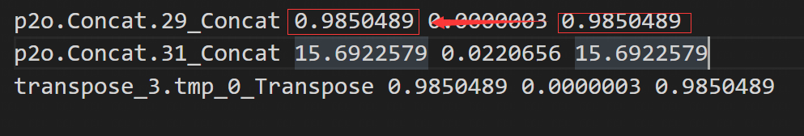

# PPYOLOE_M Sample with post_process

### Download the model and convert the model under docker (optional)
#### For new toolchain guide
The following documents are required:
* tpu-mlir_xxxx.tar.gz (The release package of tpu-mlir)

Transform cvimodel shell:
``` shell
tar zxf tpu-mlir_xxxx.tar.gz
source tpu-mlir_xxxx/envsetup.sh

mkdir workspace && cd workspace
cp $TPUC_ROOT/regression/image/dog.jpg .
cp -rf $TPUC_ROOT/regression/dataset/COCO2017 .

model_transform.py \
	--model_name ppyoloe_m \
	--model_def ./ppyoloe_m_new.onnx \
	--input_shapes [[1,3,640,640]] \
	--pixel_format "rgb" \
	--mean 123.675,116.28,103.53 \
	--scale 0.017125,0.017507,0.01743 \
	--test_input ./dog.jpg \
	--test_result ppyoloe_m_top_outputs.npz \
	--mlir ppyoloe_m.mlir

run_calibration.py \
    ppyoloe_m.mlir \
    --dataset=./COCO2017 \
    --input_num=100 \
    -o ../ppyoloe_m_calibration_table

model_deploy.py \
	--mlir ppyoloe_m.mlir \
	--quantize INT8 \
	--calibration_table ./ppyoloe_m_calibration_table \
	--chip cv183x \
	--test_input ./dog.jpg \
	--test_reference ppyoloe_m_top_outputs.npz \
	--compare_all \
	--quant_input \
	--tolerance 0.8,0.4 \
	--fuse_preprocess \
	--model ppyoloe_m_int8.cvimodel
```
#### For old toolchain guide
The following documents are required:

* cvitek_mlir_ubuntu-18.04.tar.gz

Transform model shell:

```shell
tar zxf cvitek_mlir_ubuntu-18.04.tar.gz
source cvitek_mlir/cvitek_envs.sh

mkdir workspace && cd workspace
cp $MLIR_PATH/tpuc/regression/data/dog.jpg .

assign_output.py --model ./ppyoloe_m.onnx --output p2o.Transpose.12,p2o.Concat.30

model_transform.py \
  --model_type onnx \
  --model_name ppyoloe_m \
  --model_def ./ppyoloe_m_new.onnx \
  --image ./dog.jpg \
  --image_resize_dims 640,640 \
  --keep_aspect_ratio false \
  --net_input_dims 640,640 \
  --raw_scale 1.0 \
  --mean 0.485,0.456,0.406 \
  --std 0.229,0.224,0.225 \
  --input_scale 1.0 \
  --model_channel_order "rgb" \
  --tolerance 0.99,0.99,0.99 \
  --mlir ppyoloe_m_fp32.mlir

run_calibration.py \
    ppyoloe_m_fp32.mlir \
    --dataset=/data/dataset/coco/val2017 \
    --input_num=100 \
    --calibration_table ppyoloe_m_calibration_table

model_deploy.py \
  --model_name ppyoloep \
  --mlir ppyoloe_m_fp32.mlir \
  --calibration_table ppyoloe_m_calibration_table \
  --quantize INT8 \
  --pixel_format RGB_PLANAR \
  --chip cv183x \
  --image ./dog.jpg \
  --tolerance 0.9,0.9,0.6 \
  --correctness 0.9,0.9,0.93 \
  --cvimodel ppyoloe_m_int8.cvimodel \
  --fuse_preprocess 
```

**Attention**:After run_calibration.py, we advice to mannully set the threshold of "p2o.Concat.29_Conca", "p2o.Concat.31_Concat","transpose_3.tmp_0_Transpose" the same as its max_value,like this:



Copy generated ppyoloe_m_int8.cvimodel to EVB board

## How To Compile Vpss input Sample In Docker

View the Top level directory README.md

## Run Samples In EVB Borad

```shell
cd install_samples/samples_extra
./bin/cvi_sample_detector_ppyoloem_fused_preprocess \
./ppyoloe_m_int8.cvimodel \
./data/dog.jpg \
ppyoloe_ms_out.jpg
```