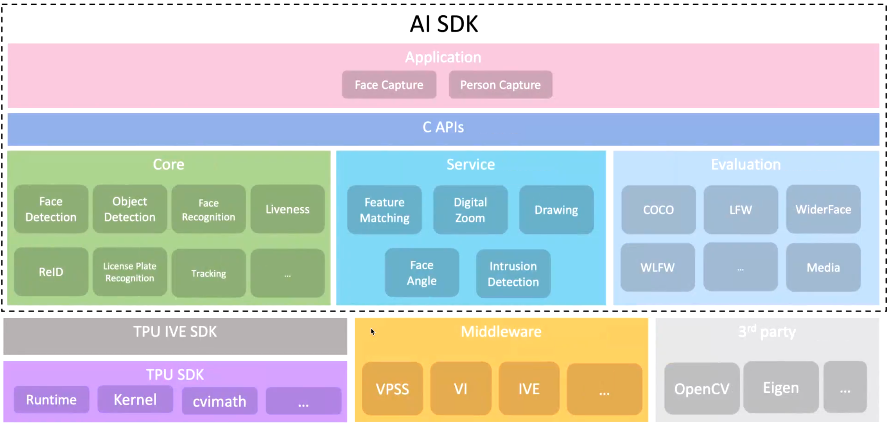

# 公版深度学习TDL（turnkey deep learning）
## 1. 概述


Cvitek所提供的TDL（Turnkey Deep Learning）集成算法， 用以缩短应用程序开发所需的时间。此架构实现了TDL所需算法包含其前后处理， 提供统一且便捷的编程接口。


TDL_SDK基于算能自研的Middleware和TPU SDK，包括内部两大模块（Core和Service）、算法C接口、算法应用（Application）。



<div style="text-align: center;">
    图1 TDL SDK系统框架
</div>

Core提供了算法相关接口，封装复杂的底层操作及算法细节，在内部会对模型进行相应的前后处理，并完成推理。Service提供算法相关辅助API，例如：绘图, 特征比对, 区域入侵判定等功能。C接口实现对现有现有算法模块的功能封装，除了支持TDL SDK内部模型外，还支持开发者自有模型（需按文档进行模型转换）。Application封装应用逻辑，如包含人脸抓拍的应用逻辑。


目前TDL SDK包含 [移动侦测](./modules/core/motion_detection)， [人脸检测](./modules/core/face_detection)， [人脸识别](./modules/core/mask_face_recognition)， [人脸关键点检测](./modules/core/face_landmarker)， [跌倒检测](./modules/core/fall_detection)， [语义分割](./modules/core/segmentation)， [车牌检测](./modules/core/license_plate_detection)， [车牌辨识](./modules/core/license_plate_recognition)， [活体识别](./modules/core/liveness)，[声音分类](./modules/core/sound_classification)， [人体关键点检测](./modules/core/human_keypoints_detection)， [车道线识别](./modules/core/lane_detection)， [目标追踪](./modules/core/deepsort)， [手势侦测](./modules/core/hand_classification)， [手势识别](./modules/core/hand_keypoint_classification)，[文字检测](./modules/core/ocr/ocr_detection)，[文本识别](./modules/core/ocr/ocr_recognition)等算法。


## 2. 仓库目录
**cmake**: 包含项目所需的 CMake 配置文件。
**docs**: 包含项目文档及其生成相关的文件。
**doxygen**: 包含 Doxygen 配置文件，用于生成 API 文档。
**include**: 存放项目的头文件，按模块组织。
**modules**: 包含项目的各个功能模块及核心模块的具体实现。
**sample**: 提供多个示例程序及其构建脚本，展示项目的功能和用法。
**scripts**: 包含各种辅助脚本，如代码检查、编译和测试脚本。
**tool**: 包含各种工具和实用程序代码。
**toolchain**: 提供不同平台的工具链配置文件。
**tutorial**: 包含项目的教程文档，帮助用户快速上手和使用项目。
编译产生的中间文件以及第三方库的下载都会位于tmp文件夹内
## 3. 编译流程
在编译TDL_SDK前，**请确保已完成了开发板固件以及其他依赖库的编译！**
否则请参考[SG200x SDK软件包](https://github.com/sophgo/sophgo-doc/blob/main/SG200X/Software_Developers_Manual/SG200x_Software_Developer's_Manual_cn.md)中的2~4。
根据开发板芯片的不同，编译需要指定4个参数，此处我们列出所有的开发板对应的参数
<table>
  <tr>
    <th>CHIP_ARCH</th>
    <th>BOARD</th>
    <th>SDK_VER</th>
    <th>MW_VER</th>
  </tr>
  <tr>
    <td rowspan="8">CV180X<br /></td>
    <td>fpga</td>
    <td rowspan="2">glibc_riscv64<br /></td>
    <td rowspan="8">v2<br /></td>
  </tr>
  <tr>
    <td>palladium</td>
  </tr>
  <tr>
    <td>wdmb_0008a_spinand</td>
    <td rowspan="6">musl_riscv64<br /></td>
  </tr>
  <tr>
    <td>wdmb_0008a_spinor</td>
  </tr>
  <tr>
    <td>wevb_0008a_spinor</td>
  </tr>
  <tr>
    <td>wevb_0009a_spinor</td>
  </tr>
  <tr>
    <td>wdmb_0009a_spinor</td>
  </tr>
  <tr>
    <td>wevb_0009a_spinand</td>
  </tr>
  <tr>
    <td rowspan="18">CV181X<br /></td>
    <td>wdmb_0006a_spinor</td>
    <td rowspan="12">musl_riscv64<br /></td>
    <td rowspan="18">v2<br /></td>
  </tr>
  <tr>
    <td>wevb_0006a_spinand</td>
  </tr>
  <tr>
    <td>wevb_0006a_spinor</td>
  </tr>
  <tr>
    <td>wevb_0007a_spinor</td>
  </tr>
  <tr>
    <td>sophpi_duo_sd</td>
  </tr>
  <tr>
    <td>wevb_0006a_emmc</td>
  </tr>
  <tr>
    <td>wevb_0007a_emmc</td>
  </tr>
  <tr>
    <td>wevb_0007a_emmc_huashan</td>
  </tr>
  <tr>
    <td>wevb_0007a_spinand</td>
  </tr>
  <tr>
    <td>wevb_0007a_spinand_huashan</td>
  </tr>
  <tr>
    <td>wevb_0007a_spinor_huashan</td>
  </tr>
  <tr>
    <td>wevb_riscv64_sd</td>
  </tr>
  <tr>
    <td>wevb_0007a_emmc</td>
    <td>glibc_riscv64</td>
  </tr>
  <tr>
    <td>wevb_0006a_spinor</td>
    <td>32bit</td>
  <tr>
  <tr>
    <td>wevb_0006a_spinand</td>
    <td rowspan="3">64bit </td>
  </tr>
    <td>wevb_arm64_sd</td>
  </tr>
  <tr>
    <td>wevb_arm64_sd</td>
  </tr>

  <tr>
    <td rowspan="6">CV186X<br /></td>
    <td>fpga</td>
    <td rowspan="5">64bit<br /></td>
    <td rowspan="6">v2<br /></td>
  </tr>
  <tr>
    <td>palladium</td>
  </tr>
  <tr>
    <td>wevb_emmc</td>
  </tr>
  <tr>
    <td>wevb_spinor</td>
  </tr>
  <tr>
    <td>wevb_spinand</td>
  </tr>
  <tr>
    <td>palladium_c906</td>
    <td>glibc_riscv64</td>
  </tr>
</table>


```
cd tdl_sdk
# export中的参数根据具体开发板给定
export CHIP_ARCH=CV180X BOARD=wevb_riscv64_sd SDK_VER=musl_riscv64 MW_VER=v2
./scripts/native_sdk_release.sh
```
## 4. 使用案例
算法接口
以人脸检测为例子
```
/**
 * @brief Detect face with score.
 *
 * @param handle An TDL SDK handle.
 * @param frame Input video frame.
 * @param face_meta Output detect result. The bbox will be given.
 * @param model_index The face detection model id selected to use.
 * @return int Return CVI_TDL_SUCCESS on success.
 */
DLL_EXPORT CVI_S32 CVI_TDL_FaceDetection(const cvitdl_handle_t handle, VIDEO_FRAME_INFO_S *frame,
                                         CVI_TDL_SUPPORTED_MODEL_E model_index,
                                         cvtdl_face_t *face_meta);
```
辅助功能接口
            以人脸画框为例
```
/**
 * @brief Draw rect to frame with given face meta with a global brush.
 * @ingroup core_cvitdlservice
 *
 * @param handle A service handle.
 * @param meta meta structure.
 * @param frame In/ out YUV frame.
 * @param drawText Choose to draw name of the face.
 * @param brush A brush for drawing
 * @return CVI_S32 Return CVI_TDL_SUCCESS if succeed.
 */
DLL_EXPORT CVI_S32 CVI_TDL_Service_FaceDrawRect(cvitdl_service_handle_t handle,
                                                const cvtdl_face_t *meta, VIDEO_FRAME_INFO_S *frame,
                                                const bool drawText, cvtdl_service_brush_t brush);
```

一个简单的调用例子:
```
#define _GNU_SOURCE
#include <stdio.h>
#include <iostream>
#include <string>
#include "core/utils/vpss_helper.h"
#include "cvi_tdl.h"
#include "cvi_tdl_media.h"
int main(int argc, char *argv[]) {
  int vpssgrp_width = 1920;
  int vpssgrp_height = 1080;
  CVI_S32 ret = MMF_INIT_HELPER2(vpssgrp_width, vpssgrp_height, PIXEL_FORMAT_RGB_888, 1,
                                 vpssgrp_width, vpssgrp_height, PIXEL_FORMAT_RGB_888, 1);
  if (ret != CVI_TDL_SUCCESS) {
    printf("Init sys failed with %#x!\n", ret);
    return ret;
  }

  cvitdl_handle_t tdl_handle = NULL;
  ret = CVI_TDL_CreateHandle(&tdl_handle);
  if (ret != CVI_SUCCESS) {
    printf("Create tdl handle failed with %#x!\n", ret);
    return ret;
  }

  std::string strf1(argv[2]);

  ret = CVI_TDL_OpenModel(tdl_handle, CVI_TDL_SUPPORTED_MODEL_SCRFDFACE, argv[1]);
  if (ret != CVI_SUCCESS) {
    printf("open model failed with %#x!\n", ret);
    return ret;
  }

  CVI_TDL_UseMmap(tdl_handle, CVI_TDL_SUPPORTED_MODEL_SCRFDFACE, false);

  imgprocess_t img_handle;
  CVI_TDL_Create_ImageProcessor(&img_handle);

  VIDEO_FRAME_INFO_S bg;
  // printf("toread image:%s\n",argv[1]);
  ret = CVI_TDL_ReadImage(img_handle, strf1.c_str(), &bg, PIXEL_FORMAT_RGB_888_PLANAR);
  if (ret != CVI_SUCCESS) {
    printf("open img failed with %#x!\n", ret);
    return ret;
  } else {
    printf("image read,width:%d\n", bg.stVFrame.u32Width);
  }
  std::string str_res;
  for (int i = 0; i < 1; i++) {
    cvtdl_face_t obj_meta = {0};
    ret = CVI_TDL_FaceDetection(tdl_handle, &bg, CVI_TDL_SUPPORTED_MODEL_SCRFDFACE, &obj_meta);
    std::stringstream ss;
    ss << "boxes=[";
    for (uint32_t i = 0; i < obj_meta.size; i++) {
      ss << "[" << obj_meta.info[i].bbox.x1 << "," << obj_meta.info[i].bbox.y1 << ","
         << obj_meta.info[i].bbox.x2 << "," << obj_meta.info[i].bbox.y2 << "],";
    }
    str_res = ss.str();
    CVI_TDL_Free(&obj_meta);
  }
  std::cout << str_res << std::endl;
  CVI_TDL_ReleaseImage(img_handle, &bg);
  CVI_TDL_DestroyHandle(tdl_handle);
  CVI_TDL_Destroy_ImageProcessor(img_handle);
  return ret;
}
```

<div style="text-align: center;">
    <video width="960" controls>
  <source src="tutorial/assets/人脸检测.mp4" type="video/mp4">
  Your browser does not support the video tag.
</video>
</div>
<div style="text-align: center;">
    人脸检测效果
</div>

更多案例还请参考[教程](tutorial)
## 5. 开发指南
详见[TDL SDK软件开发指南](https://doc.sophgo.com/cvitek-develop-docs/master/docs_latest_release/CV180x_CV181x/zh/01.software/TPU/TDL_SDK_Software_Development_Guide/build/html/index.html#)

## 6. SDK问题反馈
最后，如果您对仓库有任何的疑问或者改进想法，请通过 Issues 提交。我们欢迎所有形式的贡献，包括文档改进、bug 修复、新特性添加等等，直接参与到项目的开发和维护中，帮助我们不断改进。我们期待在您的帮助下，将本项目发展成为更加完善、易于使用的深度学习SDK库。