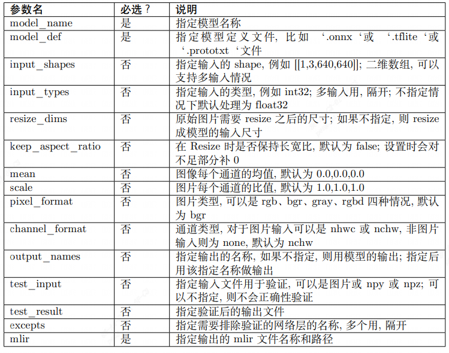
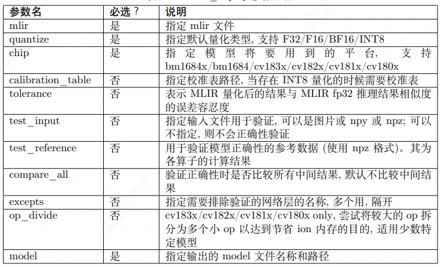

# 通用yolov5模型部署

## 引言

本文档介绍了如何将yolov5架构的模型部署在cv181x开发板的操作流程，主要的操作步骤包括：

* yolov5模型pytorch版本转换为onnx模型
* onnx模型转换为cvimodel格式
* 最后编写调用接口获取推理结果

以下是各个步骤的详细讲解：

## pt模型转换为onnx

首先可以下载yolov5官方仓库代码，地址如下

[ultralytics/yolov5: YOLOv5 🚀 in PyTorch > ONNX > CoreML > TFLite (github.com)](https://github.com/ultralytics/yolov5)

```shell
git clone https://github.com/ultralytics/yolov5.git
```

然后获取yolov5的`.pt`格式的模型，例如下载[yolov5s](https://github.com/ultralytics/yolov5/releases/download/v7.0/yolov5s.pt)，在yolov5文件夹下创建一个文件夹`weights`，并将下载的`yolov5s.pt`文件移动至此

转换onnx前，需要修改`yolov5/models/yolo.py`文件中`Detect`类中的`forward`函数：

* 首先为了避免数值不统一，注释下列`forward`函数中的20和21行代码，保证模型最后一层输出的数值范围在`[0-1]`之间，以免后续模型量化失败
* 另外最后一层的sigmoid函数也取消，如18行为原代码，修改为19行所示代码
* 然后修改`forward`函数的返回结果，不用`cat`操作，而是返回三个不同的下采样结果，直接`return z`

```python
def forward(self, x):
        z = []  # inference output
        for i in range(self.nl):
            x[i] = self.m[i](x[i])  # conv

            bs, _, ny, nx = x[i].shape  # x(bs,255,20,20) to x(bs,3,20,20,85)
            x[i] = x[i].view(bs, self.na, self.no, ny, nx).permute(0, 1, 3, 4, 2).contiguous()
            
            xywh, conf, score = x[i].split((4, 1, self.nc), 4)
            
            z.append(xywh[0])
            z.append(conf[0])
            z.append(score[0])
            
        return z
```

> 这样修改后模型的输出分别9个不同的branch:
>
> * (3, 20, 20, 80) - class
> * (3, 20, 20, 4) - box
> * (3, 20, 20, 1) - conf
> * (3, 40, 40, 80)
> * (3, 40, 40, 4)
> * (3, 40, 40, 1)
> * (3, 40, 40, 80)
> * (3, 40, 40, 4)
> * (3, 40, 40, 1)

然后使用官方的`export.py`导出onnx模型

```shell
python export.py --weights ./weights/yolov5m.pt --include onnx
```

其中`--weights`表示权重文件的相对路径，`--include`表示转换格式为`onnx`

## onnx模型转换cvimodel

### 旧工具链

导出onnx模型之后，需要将onnx模型转换为cvimodel，才能实现cv181x开发板的c++推理。cvimodel的转换需要借助量化工具。

* 首先获取`cvitek_mlir_ubuntu-18.04_tpu_rel_v1.5.0-xxxxxx.tar.gz`

* 然后创建一个文件夹名为`mlir_cvi`，并在该文件夹下创建`cvitek_mlir`，将`tpu-mlir_vxxxxxx.tar.gz`解压在`cvitek_mlir`文件夹下
* 另外，在`mlir_cvi`文件夹下创建一个路径`yolov5s/onnx`，将上一步得到的`yolov5s.onnx`移动至此

创建docker环境

```shell
docker run \
-itd \
-v /etc/localtime:/etc/localtime:ro \
-v /path/to/cache/.cache:/root/.cache \
-v /path/to/workspace/codes:/workspace \
--name="cvi_docker" \
--rm \
cvitek/cvitek_dev:1.7-ubuntu-18.04
```

使用之前创建的docker

```shell
docker exec -it mipeng_cvi bash
```

此时用户已经处理docker里面的`/workspace`目录下

声明环境变量

```shell
source cvitek_mlir/envsetup.sh
```

然后使用以下脚本转换模型，其中主要的参数设置含义如下：

* `model_dir` onnx/yolov5m.onnx上级目录名称
* `root` 当前workspace目录
* `model_name` onnx模型的名称
* `version_name` 当前转换cvimodel的版本信息，可自定义设置
* `img_dir` 存放转换cvimodel需要的测试图片的路径，需要同模型训练过程的图片分布相似，需要100张图片左右
* `img` 单张测试图片，需要对应图片的路径
* `input_size` 模型的输入图片尺寸，例如标准的yolov5输入尺寸为`(640, 640)`，这里填`input_size=640,640`

其中`raw_scale`、`mean`、`std`、`input_scale`为预处理设置，预处理的公式如下式所示：
$$
y=\frac{x \times \frac{raw\_scale}{255.0} - mean}{std}\times input\_scale
$$

```bash
# cv182x | cv183x
chip="cv181x"
# model_name="mobiledetv2-pedestrian-d0-448-p10"  | mv2_448_256

############################################################################################################
model_dir="yolov5m"
root="/workspace/mlir_cvi/${model_dir}"
model_name="yolov5m"
version_name="yolov5m"
img_dir="/path/to/img_folder/"
img="/path/to/single_image/"

intpu_size=640,640                                       ########## h,w

mlir="${root}/mlir/${version_name}_fp32.mlir"
table="${root}/calibration_table/${version_name}.threshold_table"
bf16="${root}/bf16/${version_name}_${chip}_bf16.cvimodel"
int8="${root}/int8/${version_name}_${chip}.cvimodel"
model_onnx="${root}/onnx/${model_name}.onnx"

# -------------------------------------------------------------------------------------------------------- #
############################################################################################################


mkdir "${root}/mlir"

model_transform.py \
--model_type onnx \
--model_name ${model_name} \
--model_def ${model_onnx} \
--image ${img} \
--image_resize_dims ${intpu_size}  \
--keep_aspect_ratio 1 \
--net_input_dims ${intpu_size} \
--raw_scale 255.0 \
--mean 0.0,0.0,0.0 \
--std 255.0,255.0,255.0 \
--input_scale 1.0 \
--model_channel_order "rgb" \
--tolerance 0.99,0.99,0.99 \
--mlir ${mlir}


# gen calibration_table

mkdir "${root}/calibration_table"
run_calibration.py \
${mlir} \
--dataset=${img_dir} \
--input_num 100 \
-o ${table} \
--tune_num 20 \
--tune_thread_num 10 \
--forward_thread_num 15 \
--buffer_size=20G \
--calibration_table ${table}


mkdir "${root}/int8"

model_deploy.py \
--model_name ${model_name} \
--mlir ${mlir} \
--calibration_table ${table} \
--quantize INT8 \
--chip ${chip} \
--tg_op_divide=true \
--image ${img} \
--pixel_format BGR_PLANAR \
--tolerance 0.8,0.8,0.25 \
--correctness 0.95,0.95,0.95 \
--cvimodel ${int8}
```

运行完成之后，可以在`mlir_cvi/yolov5s/int8/`目录获取到转换的cvimodel

### 新工具链(推荐)

需要获取tpu-mlir的发布包：**tpu-mlir_xxxx.tar.gz (tpu-mlir 的发布包)**

代码路径 https://github.com/sophgo/tpu-mlir

TPU-MLIR 是 TDL 芯片的 TPU 编译器工程。该工程提供了一套完整的工具链, 其可以将不同 框架下预训练的神经网络, 转化为可以在算能 TPU 上高效运算的文件。目前支持`onnx`、`Caffe`以及`TFLite`框架的模型转换，其他框架的模型需要转换成onnx模型，再通过TPU-MLIR工具转换。

转换模型需要在指定的docker执行，主要的步骤可以分为两步：

* 第一步是通过`model_transform.py`将原始模型转换为`mlir`文件
* 第二步是通过`model_deploy.py`将`mlir`文件转换成`cvimodel`

> 如果需要转换为INT8模型，还需要在第二步之前调用`run_calibration.py`生成校准表，然后传给`model_deploy.py`

#### Docker配置

TPU-MLIR需要在Docker环境开发，从DockerHub https://hub.docker.com/r/sophgo/tpuc_dev 下载所需的镜像：

```shell
docker pull sophgo/tpuc_dev:v2.2
```

如果是首次使用Docker，可以执行下述命令进行安装和配置（仅首次执行）：

```shell
sudo apt install docker.io
sudo systemctl start docker
sudo systemctl enable docker
sudo groupadd docker
sudo usermod -aG docker $USER
newgrp docker
```

确保安装包在当前目录，然后在当前目录创建容器如下：

```shell
docker run --privileged --name myname -v $PWD:/workspace -it sophgo/tpuc_dev:v2.2
```

后续的步骤假定用户当前处在docker的/workspace目录

#### 加载tpu-mlir工具包&准备工作目录

以下操作需要在Docker容器执行

> 以下文件夹创建主要是为了方便后续管理，也可按照自己喜欢的管理方式进行文件分类

新建一个文件夹`tpu_mlir`，将新工具链解压到`tpu_mlir/`目录下，并设置环境变量：

```shell
mkdir tpu_mlir & cd tpu_mlir
cp path/to/tpu-mlir_xxx.tar.gz ./
tar zxf tpu-mlir_xxx.tar.gz
source tpu_mlir_v1_2/envsetup.sh
```

创建一个文件夹，以`yolov5s`举例，创建一个文件夹`yolov5s`，并将onnx模型放在`yolov5s/onnx/`路径下

```shell
mkdir yolov5s && cd yolov5s
mkdir onnx
cp path/to/onnx ./yolov5s/onnx/
```

上述准备工作完成之后，就可以开始转换模型

#### onnx转MLIR

如果模型是图片输入, 在转模型之前我们需要了解模型的预处理。如果模型用预处理后的 npz 文件做输入, 则不需要考虑预处理。预处理过程用公式表达如下 ( x 代表输入):
$$
y=(x-mean)\times scale
$$
本例子中yolov5的图片是rgb，每个值乘以 $\frac{1}{255}$，转换成mean和scale对应为：

* mean:  0.0, 0.0, 0.0
* scale: 0.0039216, 0.0039216, 0.0039216

模型转换的命令如下：

```shell
model_transform.py \
--model_name yolov5s \
--model_def yolov5s/onnx/yolov5s.onnx \
--input_shapes [[1,3,640,640]] \
--mean 0.0,0.0,0.0 \
--scale 0.0039216,0.0039216,0.0039216 \
--keep_aspect_ratio \
--pixel_format rgb \
--test_input ../model_yolov5n_onnx/image/dog.jpg \
--test_result yolov5s_top_outputs.npz \
--mlir yolov5s/mlir/yolov5s.mlir
```

其中`model_transform.py`主要参数说明如下表所示，完整的介绍参考**tpu_mlir_xxxxx/doc/TPU-MLIR开发参考手册用户界面章节**



转换成`mlir`文件之后，会生成一个`{model_name}_in_f32.npz`文件，该文件是模型的输入文件

#### MLIR转INT8模型

**生成校准表**

转 INT8 模型前需要跑 calibration，得到校准表；输入数据的数量根据情况准备 100~1000 张 左右。 然后用校准表，生成cvimodel

生成校对表的图片尽可能和训练数据分布相似

```shell
run_calibration.py yolov5s/mlir/yolov5s.mlir \
--dataset ../model_yolov5n_onnx/COCO2017 \
--input_num 100 \
-o yolov5s/calibration_tabel/yolov5s_cali_table
```

运行完成之后会生成名为`yolov5_cali_table`的文件，该文件用于后续编译cvimode模型的输入文件

**编译**

然后生成int8对称量化cvimodel模型，执行如下命令：

> 其中`--quant_output`参数表示将输出层也量化为int8，不添加该参数则保留输出层为float32
>
> 从后续测试结果来说，将输出层量化为int8，可以减少部分ion，并提高推理速度，并且模型检测精度基本没有下降，推荐添加`--quant_output`参数

```shell
model_deploy.py \
--mlir yolov5s/mlir/yolov5s.mlir \
--quant_input \
# 添加这一行表示量化最后输出层
--quant_output \
--quantize INT8 \
--calibration_table yolov5s/calibration_table/yolov5s_cali_table \
--chip cv181x \
--test_input yolov5s_in_f32.npz \
--test_reference yolov5s_top_outputs.npz \
--tolerance 0.85,0.45 \
--model yolov5s/int8/yolov5_cv181x_int8_sym.cvimodel
```

其中`model_deploy.py`的主要参数参考如下表所示，完整的参数同样可以参考`tpu_mlir_xxxx/doc/TPU_MLIR开发参考手册.pdf`



编译完成后，会生成名为`${model_name}yolov5_cv181x_int8_sym.cvimodel$`的文件

在上述步骤运行成功之后，编译cvimodel的步骤就完成了，之后就可以使用TDL_SDK调用导出的cvimodel进行yolov5目标检测推理了。

## TDLSDK接口说明

集成的yolov5接口开放了预处理的设置，yolov5模型算法的anchor，conf置信度以及nms置信度设置

预处理设置的结构体为`Yolov5PreParam`

```c++
/** @struct InputPreParam
 *  @ingroup core_cvitdlcore
 *  @brief Config the yolov5 detection preprocess.
 *  @var InputPreParam::factor
 *  Preprocess factor, one dimension matrix, r g b channel
 *  @var InputPreParam::mean
 *  Preprocess mean, one dimension matrix, r g b channel
 *  @var InputPreParam::rescale_type
 *  Preprocess config, vpss rescale type config
 *  @var InputPreParam::keep_aspect_ratio
 *  Preprocess config quantize scale
 *  @var InputPreParam::use_crop
 *  Preprocess config, config crop
 *  @var InputPreParam:: resize_method
 *  Preprocess resize method config
 *  @var InputPreParam::format
 *  Preprocess pixcel format config
 */
typedef struct {
  float factor[3];
  float mean[3];
  meta_rescale_type_e rescale_type;
  bool keep_aspect_ratio;
  bool use_crop;
  VPSS_SCALE_COEF_E resize_method;
  PIXEL_FORMAT_E format;
} InputPreParam;
```

yolov5算法中设置的结构体为`YOLOV5AlgParam`

```c++
/** @struct cvtdl_det_algo_param_t
 *  @ingroup core_cvitdlcore
 *  @brief Config the yolov5 detection algorithm parameters.
 *  @var cvtdl_det_algo_param_t::anchors
 *  Configure yolov5 model anchors
 *  @var cvtdl_det_algo_param_t::anchor_len
 *  Configure number of yolov5 model anchors
 *  @var cvtdl_det_algo_param_t::strides
 *  Configure yolov5 model strides
 *  @var cvtdl_det_algo_param_t::stride_len
 *  Configure number of yolov5 model stride
 *  @var cvtdl_det_algo_param_t::cls
 *  Configure the number of yolov5 model predict classes
 *  @var cvtdl_det_algo_param_t::max_det
 *  Configure the number of yolov5 model maxium detection
 */
typedef struct {
  uint32_t *anchors;
  uint32_t anchor_len;
  uint32_t *strides;
  uint32_t stride_len;
  uint32_t cls;
  uint32_t max_det;
} cvtdl_det_algo_param_t;
```

以下是一个简单的设置案例:

* 初始化预处理设置`InputPreParam`以及yolov5模型设置`cvtdl_det_algo_param_t`，使用`CVI_TDL_Set_YOLOV5_Param`传入设置的参数
  * yolov5是**anchor-based**的检测算法，为了方便使用，开放了anchor自定义设置，在设置`cvtdl_det_algo_param_t`中，需要注意`anchors`和`strides`的顺序需要一一对应，否则会导致推理结果出现错误
  * 另外支持自定义分类数量修改，如果修改了模型的输出分类数量，需要设置`YolovAlgParam.cls`为修改后的分类数量
  * `InputPreParam`以及`cvtdl_det_algo_param_t`在下列代码中出现的属性不能为空

* 然后打开模型 `CVI_TDL_OpenModel`
* 再打开模型之后可以设置对应的置信度和nsm阈值：
  * `CVI_TDL_SetModelThreshold` 设置置信度阈值，默认0.5
  * `CVI_TDL_SetModelNmsThreshold` 设置nsm阈值，默认0.5

```c++
// yolo preprocess setup
InputPreParam p_preprocess_cfg;
for (int i = 0; i < 3; i++) {
    p_preprocess_cfg.factor[i] = 0.003922;
    p_preprocess_cfg.mean[i] = 0.0;
}
p_preprocess_cfg.format = PIXEL_FORMAT_RGB_888_PLANAR;

// setup yolov5 param
cvtdl_det_algo_param_t p_yolov5_param;
uint32_t p_anchors[3][3][2] = {{{10, 13}, {16, 30}, {33, 23}},
                             {{30, 61}, {62, 45}, {59, 119}},
                             {{116, 90}, {156, 198}, {373, 326}}};
p_yolov5_param.anchors = &p_anchors[0][0][0];
uint32_t strides[3] = {8, 16, 32};
p_yolov5_param.strides = &strides[0];
p_yolov5_param.anchor_len = 3;
p_yolov5_param.stride_len = 3;
p_yolov5_param.cls = 80;

printf("setup yolov5 param \n");
ret = CVI_TDL_Set_YOLOV5_Param(tdl_handle, &p_preprocess_cfg, &p_yolov5_param);
if (ret != CVI_SUCCESS) {
    printf("Can not set Yolov5 parameters %#x\n", ret);
    return ret;
}

ret = CVI_TDL_OpenModel(tdl_handle, CVI_TDL_SUPPORTED_MODEL_YOLOV5, model_path.c_str());
if (ret != CVI_SUCCESS) {
    printf("open model failed %#x!\n", ret);
    return ret;
}

// set thershold for yolov5
CVI_TDL_SetModelThreshold(tdl_handle, CVI_TDL_SUPPORTED_MODEL_YOLOV5, 0.5);
CVI_TDL_SetModelNmsThreshold(tdl_handle, CVI_TDL_SUPPORTED_MODEL_YOLOV5, 0.5);
```

**推理以及结果获取**

通过本地或者流获取图片，并通过`CVI_TDL_ReadImage`函数读取图片，然后调用`Yolov5`推理接口`CVI_TDL_Yolov5`。推理的结果存放在`obj_meta`结构体中，遍历获取边界框bbox的左上角以及右下角坐标点以及object score(x1, y1, x2, y2, score)，另外还有分类`classes`

```c++
VIDEO_FRAME_INFO_S fdFrame;
ret = CVI_TDL_ReadImage(img_path.c_str(), &fdFrame, PIXEL_FORMAT_RGB_888);
std::cout << "CVI_TDL_ReadImage done!\n";

if (ret != CVI_SUCCESS) {
    std::cout << "Convert out video frame failed with :" << ret << ".file:" << str_src_dir
              << std::endl;
}

cvtdl_object_t obj_meta = {0};

CVI_TDL_Yolov5(tdl_handle, &fdFrame, &obj_meta);

for (uint32_t i = 0; i < obj_meta.size; i++) {
    printf("detect res: %f %f %f %f %f %d\n", obj_meta.info[i].bbox.x1,
								              obj_meta.info[i].bbox.y1,
            								  obj_meta.info[i].bbox.x2, 
           									  obj_meta.info[i].bbox.y2, 
           									  obj_meta.info[i].bbox.score,
           									  obj_meta.info[i].classes);
}
```

以下是官方yolov5模型转换后在coco2017数据集测试的结果，测试平台为**CV1811h_wevb_0007a_spinor**

## 测试结果

以下测试使用阈值为：

* conf_thresh: 0.001 
* nms_thresh: 0.65

输入分辨率均为 640 x 640


|  模型   |  部署版本  | 测试平台 | 推理耗时 (ms) |  带宽 (MB)  | ION(MB) |   MAP 0.5   | MAP 0.5-0.95 |                   备注                   |
| :-----: | :--------: | :------: | :-----------: | :---------: | :-----: | :---------: | :----------: | :--------------------------------------: |
| yolov5s |  官方导出  | pytorch  |      N/A      |     N/A     |   N/A   |    56.8     |     37.4     |           pytorch官方fp32指标            |
|         |  官方导出  |  cv181x  |     92.8      |   100.42    |  16.01  |  量化失败   |   量化失败   | 官方脚本导出cvimodel, cv181x平台评测指标 |
|         |  官方导出  |  cv182x  |     69.89     |   102.74    |   16    |  量化失败   |   量化失败   | 官方脚本导出cvimodel，cv181x平台评测指标 |
|         |  官方导出  |  cv183x  |     25.66     |    73.4     |   N/A   |  量化失败   |   量化失败   | 官方脚本导出cvimodel，cv181x平台评测指标 |
|         | TDL_SDK导出 |   onnx   |      N/A      |     N/A     |   N/A   |   55.4241   |   36.6361    |            TDL_SDK导出onnx指标            |
|         | TDL_SDK导出 |  cv181x  |     87.76     |    85.74    |  15.8   |   54.204    |   34.3985    |  TDL_SDI导出cvimodel, cv181x平台评测指标  |
|         | TDL_SDK导出 |  cv182x  |     65.33     |    87.99    |  15.77  |   54.204    |   34.3985    |  TDL_SDI导出cvimodel, cv182x平台评测指标  |
|         | TDL_SDK导出 |  cv183x  |     22.86     |    58.38    |  14.22  |   54.204    |   34.3985    |  TDL_SDI导出cvimodel, cv183x平台评测指标  |
| yolov5m |  官方导出  | pytorch  |      N/A      |     N/A     |   N/A   |    64.1     |     45.4     |           pytorch官方fp32指标            |
|         |  官方导出  |  cv181x  |  ion分配失败  | ion分配失败 |  35.96  |  量化失败   |   量化失败   | 官方脚本导出cvimodel, cv181x平台评测指标 |
|         |  官方导出  |  cv182x  |    180.85     |   258.41    |  35.97  |  量化失败   |   量化失败   | 官方脚本导出cvimodel，cv181x平台评测指标 |
|         |  官方导出  |  cv183x  |     59.36     |   137.86    |  30.49  |  量化失败   |   量化失败   | 官方脚本导出cvimodel，cv181x平台评测指标 |
|         | TDL_SDK导出 |   onnx   |      N/A      |     N/A     |   N/A   |   62.7707   |   44.4973    |            TDL_SDK导出onnx指标            |
|         | TDL_SDK导出 |  cv181x  |  ion分配失败  | ion分配失败 |  35.73  | ion分配失败 | ion分配失败  |  TDL_SDI导出cvimodel, cv181x平台评测指标  |
|         | TDL_SDK导出 |  cv182x  |    176.04     |   243.62    |  35.74  |   61.5907   |   42.0852    |  TDL_SDI导出cvimodel, cv182x平台评测指标  |
|         | TDL_SDK导出 |  cv183x  |     56.53     |    122.9    |  30.27  |   61.5907   |   42.0852    |  TDL_SDI导出cvimodel, cv183x平台评测指标  |


